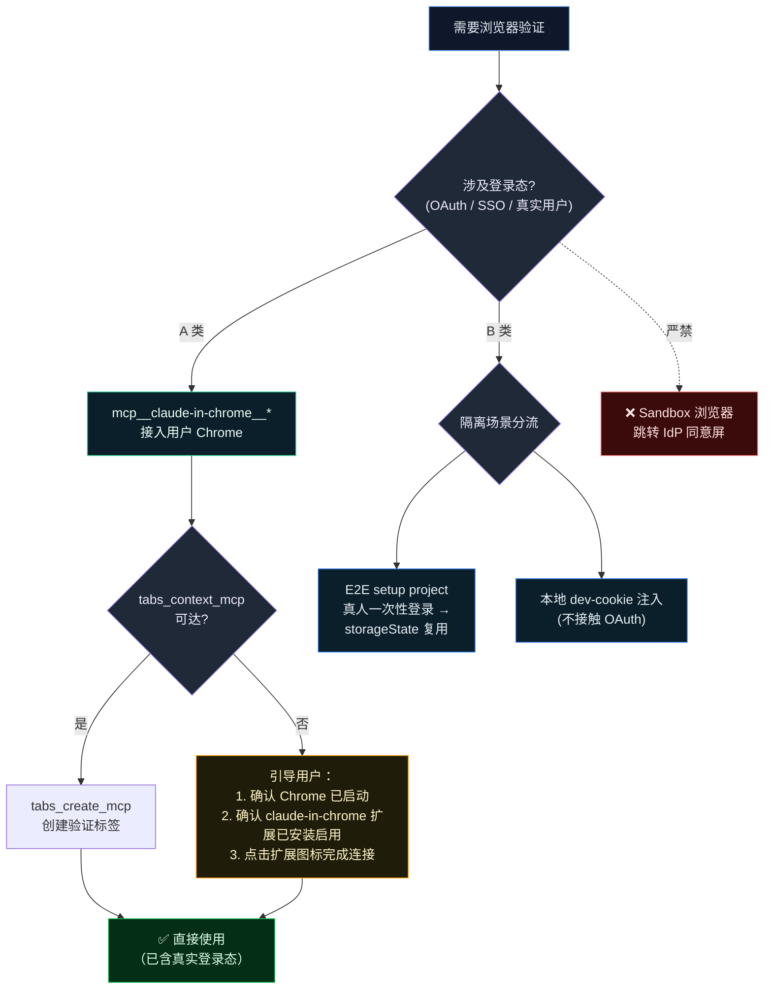
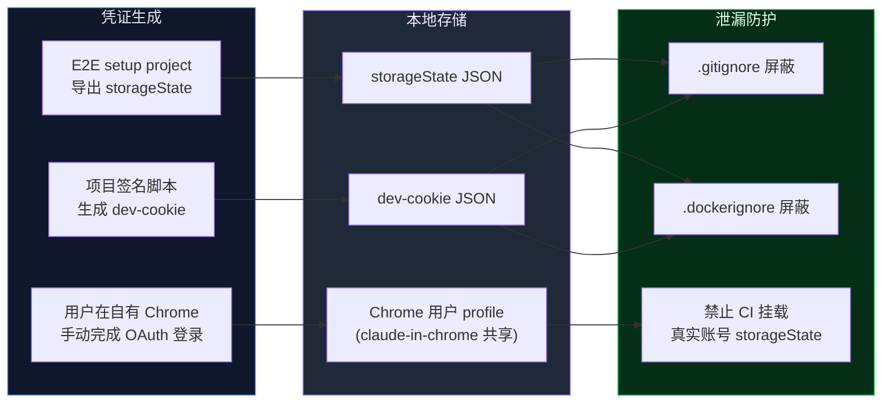

# 浏览器验证协议 (Browser Validation Protocol)

> **文档定位**：本文是 AI Agent 浏览器验证策略的**唯一详尽来源 (Single Source of Truth)**。[AGENTS.md › Browser Validation Protocol](../../AGENTS.md) 中仅保留摘要级约束，协议实体以本文为准。

---

## 1. 概述

### 1.1 适用范围

本协议规范 AI Agent（Claude Code、Codex 等）在以下浏览器操作场景中的行为准则：

- **即时验证**：Agent 在开发过程中对 UI 功能、页面渲染、网络请求的实时校验；
- **E2E 回归测试**：通过 Playwright 等框架执行端到端自动化测试；
- **OAuth / SSO 链路验证**：涉及第三方 OAuth（如 Google OAuth）或内部 SSO 的认证流程检测。

### 1.2 核心不变量 (Invariant)

> **唯一信任源：真实用户登录态。**
>
> Agent **不得**自行完成、绕过或模拟任何 OAuth / SSO 认证流程。所有登录态均来源于用户已认证的浏览器，登录动作由用户在自有浏览器内手动完成。

### 1.3 术语约定

| 术语               | 定义                                                                                                    |
| ------------------ | ------------------------------------------------------------------------------------------------------- |
| **用户浏览器**     | 用户日常使用的 Chrome，包含已登录的 IdP 账号、扩展、书签等完整用户数据                                  |
| **Sandbox 浏览器** | 无用户数据的隔离浏览器实例（如 Playwright 默认 `chromium.launch()` 或新建空白 Chrome profile）          |
| **A 类场景**       | 依赖真实用户登录态的验证场景（OAuth / SSO / IdP 服务交互），**必须**通过 `claude-in-chrome` 执行        |
| **B 类场景**       | 不依赖第三方 OAuth 的本地隔离场景（dev-cookie 注入、`storageState` 复用），可通过 Playwright 等框架执行 |
| **IdP**            | Identity Provider，身份提供商（如 Google、GitHub、Okta 等），负责签发认证凭证                           |
| **Tab Group**      | `claude-in-chrome` 扩展为每个 Agent 会话创建的隔离标签组，用于管理浏览器标签页                          |

---

## 2. 问题域

当项目采用第三方 OAuth / SSO 认证流时，Agent 在 Sandbox 浏览器中访问受保护页面会被 IdP 重定向至其登录端点。由于 Sandbox 浏览器不持有任何有效会话，认证流程会被同意屏、风控策略或多因素验证拦截<sup>[[3]](#ref3)</sup>，导致验证链路中断。

以下绕过手段均**不可行**且**被明确禁止**：

| 手段                        | 失败原因                                                                           |
| --------------------------- | ---------------------------------------------------------------------------------- |
| 自动填充密码 / 验证码       | IdP 风控基于设备指纹、IP、User-Agent 等多维信号检测异常会话<sup>[[2]](#ref2)</sup> |
| 跨浏览器复制 `storageState` | Cookie 与会话令牌绑定浏览器上下文，跨实例注入触发会话无效化                        |
| Agent 代理完成 OAuth 同意屏 | 违反 AI Agent 安全准则中敏感凭证不入 chat 的硬性要求                               |

---

## 3. 设计约束

### 3.1 目标

所有依赖登录态的浏览器验证统一通过 `mcp__claude-in-chrome__*` 接入用户**常用 Chrome**，复用**真实用户**的已认证会话态。用户仅需在自有浏览器中手动完成一次登录。

### 3.2 非目标

- 不实现密码自动填充 / 验证码自动接收 / CAPTCHA 自动求解；
- 不在 Sandbox / 空白 profile / 模拟身份下处理 OAuth / SSO 登录跳转；
- 不在 CI / 共享环境中长期托管真实账号 `storageState`；
- 不为多账号热切换提前抽象 profile manager（YAGNI）。

---

## 4. 架构决策

### 4.1 驱动选型

**唯一驱动：`mcp__claude-in-chrome__*`（Claude in Chrome 扩展）。**

选型依据：

1. 通过 Chrome 扩展直接接入用户日常使用的 Chrome，共享完整设备指纹与登录历史，规避 IdP 风控拦截；
2. 无需用户手动添加 `--remote-debugging-port` 启动参数，扩展安装后自动建立连接，零额外配置；
3. 提供 Tab Group 隔离机制，每个 Agent 会话拥有独立标签组，互不干扰；
4. 同时支持视觉交互（`computer` 截图 + 鼠标键盘）与无障碍树（`read_page`）双通道，适应不同验证需求；
5. 内置批量操作（`browser_batch`）与 GIF 录制（`gif_creator`），提升验证效率与文档化能力。

> **A 类（交互）vs B 类（自治）的驱动分工**：上述"唯一驱动"针对 **A 类交互场景**——由开发者或 Agent 在**真人监督**的会话中验证 OAuth/SSO/认证态 UI，复用用户真实 Chrome 登录态。而 **B 类自治场景**（[Routine](../concepts/039-the-routine-system.md) 后台 Claude Code 子进程：无真人、无桌面、headless）无法使用 claude-in-chrome（其需可见桌面浏览器 + 人工完成登录/CAPTCHA，且非 command/url 形态、无法注入 mcp_config）。为此，系统将 **Playwright MCP（`@playwright/mcp`，headless · isolated）内置为全系统默认浏览器操作 MCP**，经单一注入点 `builtin_tools(claude_code).config.mcp_config` provision 至所有 Routine 运行时，用于浏览器实机回归验证；鉴权回归复用本仓 dev-cookie storageState 旁路（§9，**非** IdP storageState 复制）。选型论证见 [浏览器操作 MCP 调研](../research/120-browser-automation-mcp.md)，集成与使用见 [浏览器操作 MCP 集成方案](../concepts/design/browser-automation-mcp-integration.md)。

### 4.2 工具职责矩阵

| 维度         | `mcp__claude-in-chrome__*`（**唯一驱动**）                                    | `mcp__playwright__*`（**仅限 B 类场景**）                                        |
| ------------ | ----------------------------------------------------------------------------- | -------------------------------------------------------------------------------- |
| 浏览器实例   | 用户常用 Chrome（扩展接入，共享真实 profile）                                 | Playwright 自启动 Chromium（独立 Sandbox）                                       |
| 登录态来源   | 用户原生已登录 Chrome；扩展自动共享会话                                       | 默认空 profile，需 `storageState` / `userDataDir` 注入                           |
| OAuth 兼容性 | ✅ 高（同设备指纹 / 同登录历史）                                               | ❌ 禁止（触发 IdP 风控拦截）                                                      |
| 适用场景     | A 类：Agent 即时验证、OAuth/SSO 链路、IdP 服务交互、UI 回归                   | B 类：① E2E setup project 人工登录后 `storageState` 复用；② 本地 dev-cookie 注入 |
| 凭证安全语义 | 用户全程在自有浏览器内完成敏感操作，不持久化任何凭证副本                      | `storageState` / `userDataDir` 仅落本地，须 `.gitignore` 保护                    |
| 额外能力     | `gif_creator` 录制验证过程；`browser_batch` 批量操作；`find` 自然语言元素定位 | 完整 Playwright API（测试框架级控制）                                            |

### 4.3 核心工具速查

| 功能       | 工具                               | 说明                                                      |
| ---------- | ---------------------------------- | --------------------------------------------------------- |
| 连通性检查 | `tabs_context_mcp`                 | 获取当前 Tab Group 信息，`createIfEmpty: true` 可自动创建 |
| 新建标签页 | `tabs_create_mcp`                  | 在当前 Tab Group 中创建新标签                             |
| 导航       | `navigate`                         | 跳转至指定 URL                                            |
| 页面读取   | `read_page`                        | 获取无障碍树（结构化，适合交互操作）                      |
| 视觉截图   | `computer` (screenshot)            | 截取当前页面或指定区域截图（适合视觉验证）                |
| 元素查找   | `find`                             | 以自然语言描述查找页面元素                                |
| 表单填写   | `form_input` / `browser_fill_form` | 设置表单元素值                                            |
| JS 执行    | `javascript_tool`                  | 在页面上下文执行 JavaScript                               |
| 点击交互   | `computer` (left_click)            | 通过坐标点击页面元素                                      |
| 键盘输入   | `computer` (type) / `type_text`    | 键入文本                                                  |
| 控制台日志 | `read_console_messages`            | 读取浏览器控制台输出                                      |
| 网络请求   | `read_network_requests`            | 读取页面网络请求                                          |
| 批量操作   | `browser_batch`                    | 单次调用顺序执行多个操作                                  |
| GIF 录制   | `gif_creator`                      | 录制验证过程并导出                                        |
| 关闭标签   | `tabs_close_mcp`                   | 关闭指定标签                                              |

### 4.4 场景路由决策



---

## 5. 安全模型

### 5.1 禁止行为 (Forbidden Actions)

| 编号 | 禁止行为                                                     | 违反原则         |
| ---- | ------------------------------------------------------------ | ---------------- |
| F-1  | 在 Sandbox 浏览器中跳转 IdP 同意屏                           | 核心不变量 §1.2  |
| F-2  | 以模拟用户或第三方账号替代真实用户完成登录态验证             | 核心不变量 §1.2  |
| F-3  | 要求用户在 chat 中粘贴密码、Cookie 或一次性验证码            | 敏感信息保护准则 |
| F-4  | 读取、复制或传输用户密码 / 验证码 / Refresh Token            | 敏感信息保护准则 |
| F-5  | 将 `storageState` / `cookies` / `userDataDir` 提交至版本控制 | 凭证泄漏防护     |

### 5.2 凭证生命周期管理



### 5.3 事件响应

若怀疑会话凭证泄漏：

1. 立即通过 IdP 的设备管理页面撤销相关会话（如 [Google 设备管理](https://myaccount.google.com/device-activity)）；
2. 删除本地所有 `storageState` 与 `userDataDir` 产物；
3. 重新执行 §6 连通性自检流程。

---

## 6. 运维规程：连通性自检

每次会话**首次**需要登录态浏览前，Agent **必须**按以下顺序执行自检。任一步骤失败应**立即中止**并向用户报告现象，**禁止**以"换 Sandbox 重试"等方式暗箱降级。

### Step 1 — 扩展接入与 Tab Group 初始化

```ts
// 1) 获取 Tab Group 上下文（自动创建若不存在）
mcp__claude-in-chrome__tabs_context_mcp({ createIfEmpty: true });

// 2) 创建验证标签
mcp__claude-in-chrome__tabs_create_mcp();

// 3) 导航至 IdP 账号页验证登录态（以 Google 为例）
mcp__claude-in-chrome__navigate({ url: "https://myaccount.google.com", tabId: <tabId> });
```

**验收条件**：

- `tabs_context_mcp` 返回有效 Tab Group 信息（包含至少一个 tab ID）；
- 导航至 IdP 账号页后，页面内容包含用户账号标识（如邮箱地址），可通过 `get_page_text` 或 `read_page` 确认。

**异常处理**：

| 现象                            | 处置                                                                                                                         |
| ------------------------------- | ---------------------------------------------------------------------------------------------------------------------------- |
| `tabs_context_mcp` 返回空或报错 | 引导用户确认：① Chrome 已启动并处于前台；② claude-in-chrome 扩展已安装且已启用；③ 点击扩展图标完成连接，**禁止**改用 Sandbox |
| 接入成功但 IdP 账号页未识别用户 | 引导用户在该 Chrome 中手动登录目标账号（Agent 不接触密码 / 验证码）                                                          |

> [!NOTE]
> 若用户有多个 Chrome profile，需确保 claude-in-chrome 扩展安装在包含目标 IdP 账号的 profile 中。

### Step 2 — 应用 OAuth 链路打通

```ts
// 替换为项目实际的 OAuth 登录入口
mcp__claude-in-chrome__navigate({
  url: "http://localhost:<PORT>/<AUTH_LOGIN_PATH>",
  tabId: <tabId>,
});
```

**前置条件**：本地 dev server（前端 + 后端）已启动。

**验收条件**：无需重新输入密码，自动回跳应用首页并完成会话写入。

**异常处理**：检查项目配置中 OAuth callback URL 是否与当前运行端口一致。

> [!IMPORTANT]
> Step 1 与 Step 2 之间应保持 **≥ 3 秒**间隔，避免短时高频跳转触发 IdP CAPTCHA 验证。

---

## 7. 常用操作模式

### 7.1 页面验证

```ts
// 方式 A：无障碍树读取（推荐用于交互操作）
mcp__claude-in-chrome__read_page({ tabId: <tabId> });

// 方式 B：视觉截图（推荐用于 UI 验证）
mcp__claude-in-chrome__computer({ action: "screenshot", tabId: <tabId> });
```

### 7.2 元素交互

```ts
// 自然语言查找元素
mcp__claude-in-chrome__find({ query: "登录按钮", tabId: <tabId> });

// 通过坐标点击
mcp__claude-in-chrome__computer({ action: "left_click", coordinate: [x, y], tabId: <tabId> });

// 表单填写
mcp__claude-in-chrome__form_input({ ref: "<element_ref>", value: "<value>", tabId: <tabId> });
```

### 7.3 调试辅助

```ts
// 读取控制台日志
mcp__claude-in-chrome__read_console_messages({ tabId: <tabId>, pattern: "error|warning|<APP_PREFIX>" });

// 读取网络请求
mcp__claude-in-chrome__read_network_requests({ tabId: <tabId>, urlPattern: "/api/" });

// 执行 JavaScript
mcp__claude-in-chrome__javascript_tool({ action: "javascript_exec", text: "document.title", tabId: <tabId> });
```

### 7.4 批量操作

单次调用顺序执行多个操作，减少回合开销：

```ts
mcp__claude-in-chrome__browser_batch({
  actions: [
    { name: "navigate", input: { url: "http://localhost:<PORT>/login", tabId: <tabId> } },
    { name: "computer", input: { action: "screenshot", tabId: <tabId> } },
    { name: "find", input: { query: "登录按钮", tabId: <tabId> } },
    { name: "computer", input: { action: "left_click", coordinate: [x, y], tabId: <tabId> } },
  ],
});
```

### 7.5 验证过程录制

对于需要留档或分享的验证流程，可使用 GIF 录制：

```ts
// 开始录制
mcp__claude-in-chrome__gif_creator({ action: "start_recording", tabId: <tabId> });

// ... 执行验证操作 ...

// 停止录制并导出
mcp__claude-in-chrome__gif_creator({
  action: "export",
  tabId: <tabId>,
  download: true,
  filename: "validation-<scenario>.gif",
});
```

---

## 8. E2E 测试集成

### 8.1 会话复用工作流

```mermaid
sequenceDiagram
  participant Dev as 开发者
  participant PW as Playwright Runner
  participant Browser as Headed Chromium
  participant FS as 本地文件系统

  rect rgb(15, 23, 42)
    Note over Dev,FS: Phase 1 — 一次性登录（有头模式）
    Dev->>PW: 执行 setup project
    PW->>Browser: 启动有头浏览器
    Browser-->>Dev: 弹出 IdP 登录窗口
    Dev->>Browser: 手动完成 OAuth 登录
    Browser-->>PW: page.context().storageState()
    PW->>FS: 写入 .auth/user.json
  end

  rect rgb(5, 46, 22)
    Note over Dev,FS: Phase 2 — 测试执行（无头模式）
    Dev->>PW: 执行测试
    PW->>Browser: 启动新 context（headless）
    PW->>Browser: 注入 storageState
    Browser->>Browser: 以已登录态访问应用
  end
```

Playwright E2E 测试通过 `setup` project 实现一次性人工登录后的会话复用<sup>[[1]](#ref1)</sup>：



### 8.2 会话失效与刷新

| 触发条件                        | 应对措施                                                             |
| ------------------------------- | -------------------------------------------------------------------- |
| IdP 会话过期                    | 删除 `storageState` 文件后重跑 `setup` project（`--headed` 模式）    |
| 后端会话存储重建                | 同上                                                                 |
| Cookie 域 / `SameSite` 属性变更 | 同上；建议 setup project 末尾增加 URL 断言确认登录成功（见 §10 R-2） |

### 8.3 CI 环境注意事项

依赖真实登录态的集成测试需外部后端服务与有效认证密钥。CI 环境中建议：

- 通过环境变量开关控制 authed project 的注册，缺失时自动跳过；
- 认证辅助模块不内联 secret（防止入库），env 缺失时 fail-fast 并指向本文档；
- 不依赖后端的 mocked spec 始终全跑，确保 CI 覆盖率。

---

## 9. Dev-Cookie 旁路方案

适用于**不经第三方 OAuth** 的本地 Agent 开发场景，通过项目自签 cookie 直接获取业务页面访问权限。

### 9.1 工作原理

项目提供签名脚本，基于共享密钥（如 `AUTH_TOKEN_SECRET`）生成合法的会话 cookie。该 cookie 与 OAuth 颁发的 cookie 格式相同，后端 token 解码逻辑不区分来源，因此可在本地开发中绕过 OAuth 流程。

### 9.2 注入方式

**方式 A — 通过 `claude-in-chrome` 运行时注入**（适用于 Agent 即时验证）：

```ts
// 1. 导航至应用同源页面（建立 cookie 作用域）
mcp__claude-in-chrome__navigate({ url: "http://localhost:<PORT>/", tabId: <tabId> });

// 2. 注入 dev-cookie
mcp__claude-in-chrome__javascript_tool({
  action: "javascript_exec",
  text: `document.cookie = "<COOKIE_NAME>=<TOKEN>; path=/; SameSite=Lax"; document.cookie.includes("<COOKIE_NAME>")`,
  tabId: <tabId>,
});

// 3. 导航至目标页面
mcp__claude-in-chrome__navigate({ url: "http://localhost:<PORT>/<TARGET_PATH>", tabId: <tabId> });
```

**方式 B — `storageState` 持久化**（推荐用于 spec 复用）：

```bash
# 1. 生成 storageState 文件
node <path/to/sign-script> --storage-state <path/to/.auth/dev-admin.json>

# 2. 以 storageState 运行测试
PLAYWRIGHT_STORAGE_STATE=<path/to/.auth/dev-admin.json> \
npx playwright test <your.authed.spec.ts>
```

### 9.3 注意事项

| 项目                       | 说明                                                                                          |
| -------------------------- | --------------------------------------------------------------------------------------------- |
| `localhost` vs `127.0.0.1` | 若 dev server 仅监听 `localhost`（IPv6），浏览器导航**必须**使用 `localhost` 而非 `127.0.0.1` |
| `httpOnly` 属性            | 通过 `document.cookie` 注入的 cookie 为非 httpOnly，但浏览器仍随后续同源请求发送              |
| Cookie 持久性              | 浏览器 context 在导航间保持 cookie，但 context 关闭后丢失                                     |

---

## 10. 风险矩阵

| 编号 | 风险                | 影响                                           | 概率 | 对策                                                                        |
| ---- | ------------------- | ---------------------------------------------- | ---- | --------------------------------------------------------------------------- |
| R-1  | IdP 风控误报        | 短时高频跳转触发 CAPTCHA / 邮箱验证            | 中   | 自检各步骤间保持 ≥ 3s 间隔；避免自动化循环中重复触发 OAuth                  |
| R-2  | `storageState` 漂移 | Cookie 域 / `SameSite` 变更后旧 state 静默失效 | 低   | setup project 末尾增加 URL 断言确认登录成功（如排除 `/auth/login` 路径）    |
| R-3  | 多账号干扰          | 浏览器同时登录多个 IdP 账号致 OAuth 选择器弹出 | 低   | 自检失败时将账号选择器纳入指引，由用户在浏览器内显式选择目标账号            |
| R-4  | 凭证泄漏            | `storageState` 文件意外提交至版本控制          | 低   | `.gitignore` + `.dockerignore` 双重屏蔽；CI 禁止挂载真实账号 `storageState` |
| R-5  | 扩展连接中断        | claude-in-chrome 扩展与 Agent 会话断连         | 低   | 引导用户点击扩展图标重新建立连接；必要时重启 Chrome                         |

---

## 附录. 协议演进记录

| 日期       | 变更                                                                                                                                                 |
| ---------- | ---------------------------------------------------------------------------------------------------------------------------------------------------- |
| 2026-05-06 | 废弃浏览器扩展首选方案，统一收敛至 `mcp__chrome_devtools__*` 唯一驱动                                                                                |
| 2026-05-15 | 文档结构重组：引入术语约定、安全模型、风险矩阵；将项目特化案例移至附录                                                                               |
| 2026-05-15 | 协议泛化：移除项目特化描述，使协议可通用于所有需要浏览器验证的 Agent 行为规范                                                                        |
| 2026-05-16 | 驱动迁移：从 `mcp__chrome_devtools__*` 迁移至 `mcp__claude-in-chrome__*`，利用 Chrome 扩展实现零配置接入；新增常用操作模式章节；泛化所有项目特化引用 |
| 2026-06-06 | 厘清 A 类（claude-in-chrome 交互）/ B 类（自治）分工；将 **Playwright MCP（`@playwright/mcp`）内置为全系统默认浏览器操作 MCP**，经 `builtin_tools(claude_code).config.mcp_config` 单一注入点 provision 至所有 Routine 运行时，用于浏览器实机回归验证（见 [集成方案](../concepts/design/browser-automation-mcp-integration.md)） |

---

## References (IEEE)

<a id="ref1"></a>[1] Microsoft, "Authentication," _Playwright Documentation_, 2025. [Online]. Available: https://playwright.dev/docs/auth.

<a id="ref2"></a>[2] OWASP Foundation, "Session Management Cheat Sheet," _OWASP Cheat Sheet Series_, 2024. [Online]. Available: https://cheatsheetseries.owasp.org/cheatsheets/Session_Management_Cheat_Sheet.html.

<a id="ref3"></a>[3] D. Hardt, "The OAuth 2.0 Authorization Framework," _IETF RFC 6749_, Oct. 2012, doi: 10.17487/RFC6749.
