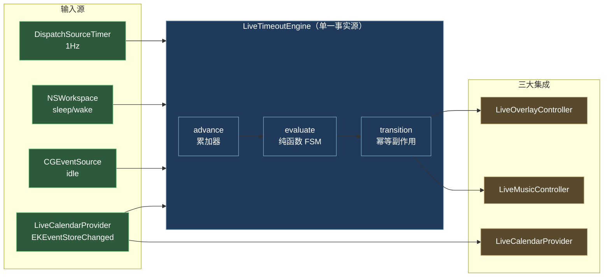

# Timeout 🍅

> macOS 菜单栏强制作息应用——在自定义工作时段内执行「工作 / 强制休息」节律，休息时**遮罩全部显示器**并**播放舒缓音效**（内置粉噪音 + 可选 QQ 音乐联动）；接入 **Google 日历**会议，会议计为工作时间但**休息自然后延**。

  
[](https://github.com/ThreeFish-AI/timeout/actions/workflows/ci.yml) [](https://github.com/ThreeFish-AI/timeout/actions/workflows/lint.yml)

## 设计哲学

熵减：用「上下文驱动、最小干预、循证工程」原则，对抗每天作息的无序。完整设计与循证调研见 [设计文档](./docs/timeout-design.md)，协作规约见 [AGENTS.md](./AGENTS.md)。

## 核心能力

- **强制排版作息**：工作窗口内每累计 N 分钟（默认 50）→ 强制休息 M 分钟（默认 10）。
- **全屏遮罩**：休息时遮罩所有显示器（`CGShieldingWindowLevel`，压过菜单栏/Dock/全屏），按 Esc 需**二次确认**才可提前结束（软强制，留逃生阀）。
- **休息音效**：进入休息播放内置**粉噪音**（AVAudioEngine 实时合成，零音频文件、不依赖外部播放器，可靠）；可选联动 QQ 音乐（经系统 Now Playing 路由的 CGEvent 媒体键）。结束休息自动停止。两者均可在设置中开关。
- **Google 日历门控**：会议计为工作时间，但休息推迟到会议结束。例：工作 30min 后接 30min 会议 → 连续工作 60min，会议结束才开始 10min 休息。
- **健壮性**：AFK/睡眠暂停累加（不回灌）、崩溃恢复（fast-forward）、多屏热插拔、状态持久化。

## 架构总览



**正交分解**（[详细 FSM](./docs/timeout-design.md#调度引擎)）：`evaluate` 是零时间依赖纯函数（注入虚拟时钟可测）；`LiveTimeoutEngine` 仅汇聚输入 + 调用纯函数 + 幂等分发；三大 Controller 各封装系统 API 与权限。三模块：`TimeoutEngine`（纯核心）、`TimeoutIntegrations`（AppKit/EventKit/CGEvent）、`Timeout`（@main 壳）。

## 环境要求

- **macOS 14+**（Sonoma 及以上，本机实测 macOS 26.5.1）。
- **Swift 工具链**：Command Line Tools 即可（`swift --version` ≥ 6.0）。**无需安装完整 Xcode**——本工程用 Swift Package Manager + `Makefile` 手工装配 `.app`。
- `codesign` / `xcrun notarytool` 随 Command Line Tools 附带。

## 构建与运行

```bash
# 装配 Timeout.app（ad-hoc 签名 + Hardened Runtime）并运行
make run

# 或分步
make build      # swift build -c release
make app        # 装配 .app + codesign + 清 quarantine
open Timeout.app

# 单元测试（自建运行器，CLT 无 XCTest）
make test
```

**快速验证遮罩/音乐**（⚠️ 会遮罩你的屏幕约 15 秒）：

```bash
TIMEOUT_DEBUG=1 .build/release/Timeout
# → 8s 工作 → 全屏遮罩 + 拉起 QQ 音乐 → 15s 后自动退出遮罩 + 暂停音乐
```

## 权限授予（首次运行，全部由你在系统设置手动完成）

Timeout 是**非沙盒**应用（沙盒会阻断媒体键与日历自动化）。运行后请在「系统设置 → 隐私与安全性」依次授予：

| 权限 | 用途 | 触发时机 |
|---|---|---|
| **辅助功能 (Accessibility)** | CGEvent 合成媒体键控制 QQ 音乐 | 首次启动弹引导窗 |
| **完全日历访问** | EventKit 读取 Google 日历会议 | 首次启动请求 |
| **自动化 (Automation)** | 仅当未来启用 AppleScript 回退时 | 按需 |

> Agent 不得绕过任何权限授予——均由用户在系统设置完成（同构于 [浏览器验证协议](./.agents/browser-validation.md) 的登录态红线）。

## QQ 音乐与 Google 日历准备

- **休息音效（默认开）**：内置**粉噪音**无需任何准备，开箱即用。可选联动 **QQ 音乐**：安装至 `/Applications/QQMusic.app` 并授予辅助功能权限（其注册为系统 Now Playing 应用，故媒体键可路由控制；**不可** AppleScript 脚本化，已二进制验证）。两者均可在设置中开关。
- **应用图标**：装配自动生成（`leaf.fill` 绿叶 + teal 渐变 squircle，方案 A）。
- **Google 日历**：在「系统设置 → Internet 账户」添加 Google 账户并启用日历 → 经 CalDAV 同步至 macOS 日历 → EventKit 自动可见（**无 OAuth 代码**，复用 OS 登录态）。

## 配置

配置文件：`~/Library/Application Support/com.aurelius.timeout/config.json`（缺失则用默认；旧版配置自动平滑迁移）。默认即用户所述作息：

```json
{
  "schemaVersion": 2,
  "workWindows": [
    { "start": { "hours": 9 }, "end": { "hours": 12 } },
    { "start": { "hours": 13, "minutes": 40 }, "end": { "hours": 18 } }
  ],
  "workIntervalSeconds": 3000,
  "restDurationSeconds": 600,
  "afkThresholdSeconds": 180,
  "ambientSoundEnabled": true,
  "controlQQMusic": true
}
```

可在**设置窗口**图形化编辑（即时保存 + 引擎热更新，无需手动改 JSON）。菜单栏显示「英文状态 + 倒计时」（如 `Work 23′` / `Break 8′`），下拉菜单提供「立即休息 / 设置 / 退出」；「开机自启」已迁入设置窗口的「一般」分组。

## 验证

- **单元测试**：`make test`（30 用例，<1s）覆盖 FSM 谓词优先级、工作示例（30+30→60→10）、AFK 冻结、睡眠不回灌、fast-forward、区间合并等。详见 [设计文档](./docs/timeout-design.md#测试矩阵)。
- **端到端**（真机，三权限 + QQ 音乐 + Google 账户）：`TIMEOUT_DEBUG=1` 观察遮罩/音乐周期；正常时段等待 50min 触发；日历建会议验证推迟。

## 已知限制（透明披露）

- **强制休息无法阻止 force-quit**：Cmd-Opt-Esc / `kill` 始终可终止——这是 macOS 设计，非恶意软件。软强制提供摩擦而非硬锁。
- **QQ 音乐联动依赖外部条件**：媒体键控 QQ 音乐需 (a) 已安装 `/Applications/QQMusic.app`、(b) 已授辅助功能权限、(c) QQ 音乐注册为 Now Playing，任一不满足即静默失败（toggle 语义还可能在播放中误暂停）。**故默认叠加内置粉噪音**作为可靠休息音效——无论 QQ 音乐是否可用都有声。失败原因见 Console.app 日志（`[Timeout][music]`）。详见 [issue #3](./.agents/issue.md)。
- **日历过滤近似**：「仅 Google」靠 `.calDAV` 源过滤；若有其他 CalDAV 账户（Yahoo/Fastmail）会被纳入。
- **macOS 26 `canBecomeKey`**：遮罩面板设为可成为 key 以收 Esc；beta 期有崩溃报告，需目标版本实机回归（已预置 [issue](./.agents/issue.md)）。

## 项目结构

```
├── Package.swift                  # SPM：TimeoutEngine / TimeoutIntegrations / Timeout 三目标
├── Sources/
│   ├── TimeoutEngine/             # 纯 Foundation：FSM + evaluate 纯函数 + 模型 + 持久化
│   ├── TimeoutIntegrations/       # AppKit/EventKit/CGEvent：遮罩 + 音乐 + 日历 + 心跳 + 装配
│   └── Timeout/                   # @main 壳 + AppDelegate
├── tests/                         # 自建测试运行器（Harness + Cases + main）
├── docs/timeout-design.md         # 设计文档（FSM + IEEE 引用）
├── Makefile / Resources/          # .app 装配 + Info.plist + entitlements
└── .agents/                       # 协作文档（knowledge-map / issue / 引用规范）
```

## Windows 移植（进行中）

macOS 是当前主版本。Windows 版采用 **C#/.NET 8 WPF 重写**（非 Swift 直编——77% 代码绑定 Apple 专有框架，Windows 物理不存在，详见 [`docs/windows-port-design.md`](./docs/windows-port-design.md) §2 循证）。

**进展**（Swift `Sources/` 零改动，C# 平行重写）：

- **Phase 0 ✅**：`windows/TimeoutEngine/` C# 重写纯核心 + `shared/` 黄金 fixture（两端共用同一份 JSON 保证 FSM 不漂移），xUnit 25 + Swift 34 双端全绿。
- **Phase 1 ✅**：`windows/TimeoutEngine.Win32/`（net8.0 互操作层，12 测试 macOS 本地可验证）+ `windows/TimeoutShell/`（net8.0-windows WPF 最小壳：NAudio 粉噪音 + SendInput 媒体键 + H.NotifyIcon 托盘）。**验证靠 CI**（macOS 无法运行 Windows-only 代码）：L1 双平台 net8.0 测试、L2 壳编译、L3 headless 烟测。
- **Phase 2 ✅**：全屏强制遮罩（`WS_EX_TOPMOST` + `WH_KEYBOARD_LL` soft-force + Esc 双语义，§5 妥协设计）；CI 验证接入闭环，真实覆盖/键盘拦截/Esc 双语义归真机验收。
- **Phase 3 ✅**：日历门控（Microsoft Graph + MSAL 设备码 + 条件注入降级，解析层/缓存/Provider mock 可测）；OAuth 授权与真实会议数据归 Windows 真机验收（CI 无账户）。
- **Phase 4 ✅**：CI 多平台 Release（`release.yml` 3-job matrix，打 tag 即同时发布 macOS + Windows 双 asset）；Windows 暂无签名（SmartScreen 告知，签名留后续 Azure Trusted Signing/证书单独 workflow）。

**Windows 构建**（需 Windows + .NET 8 SDK，macOS 无法编译 WPF 工程）：

```powershell
dotnet build windows/TimeoutShell/TimeoutShell.csproj -c Release
dotnet publish windows/TimeoutShell/TimeoutShell.csproj -c Release -r win-x64 --self-contained -o ./publish
.\publish\TimeoutShell.exe
```

配置文件：`%APPDATA%\com.aurelius.timeout\`（与 macOS 同 schema）。**真机验收限制**：托盘图标、粉噪音出声、QQ 音乐联动、全屏遮罩覆盖/键盘拦截需在 Windows 真机验收（CI 无 explorer shell/音频设备/QQ 音乐/桌面会话）；CI 验证接入闭环与不崩。

## License

MIT © Aurelius Huang
