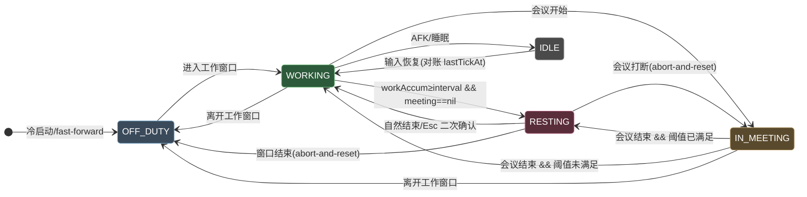

# Give me a break 设计文档

> macOS 强制作息应用的工程设计与循证依据。协作规约见 [AGENTS.md](../AGENTS.md)，快速上手见 [README](../README.md)。

## 1. 设计目标

在用户自定义工作时段内执行「工作 / 强制休息」节律；休息时遮罩全部显示器并控制 QQ 音乐；Google 日历会议计为工作但推迟休息。核心是**单调 wall-clock 工作累加器 + 反应式 FSM**，对抗「会议/睡眠/AFK」等非确定性输入对静态日程的扰动。

## 2. 调度引擎

### 2.1 状态机（5 态）



色彩语义：蓝灰=下班、绿=工作、琥珀=会议、品红=休息、中性灰=空闲；前景 `#fff` + 深色填充，深/浅模式对比度均 > 7:1（WCAG AAA）。

### 2.2 谓词优先级（`evaluate` 纯函数）

```
evaluate(now) 按顺序短路求值，首个匹配决定目标态：
  (1) NOT inAnyWorkWindow(now)  → OFF_DUTY      [最高，压过会议]
  (2) isAFK(now) OR isAsleep    → IDLE
  (3) activeMeeting(now) != nil → IN_MEETING    [会议压过休息]
  (4) workAccum >= workInterval → RESTING
  (5) otherwise                 → WORKING
触发休息的不变量：workAccum >= workInterval AND activeMeeting == nil
```

`evaluate` 是**零时间依赖纯函数**<sup>[[1]](#ref1)</sup>：所有时间经注入的 `Clock` 进入快照，可用 `VirtualClock` 单元测试。

### 2.3 累加器推进规则（防跨睡眠回灌）

每 tick：`delta = now - lastTickAt`（限幅 ≤ 60s 防异常 tick）→ **第一步即更新 `lastTickAt = now`** → 仅当 `active && phase ∈ {working, inMeeting}` 才 `workAccum += delta`。睡眠/AFK 期间 `active=false`，delta 不计入；`handleWake()` 强制 `lastTickAt = now`，使首个唤醒 tick 的 delta≈0，**不回灌睡眠时长**<sup>[[2]](#ref2)</sup>。

### 2.4 工作示例验证（30 + 30 会议 → 60 工作 → 10 休息）

`workInterval=3000s`（50min）。t=0 WORKING 累加至 30min → t=30 会议开始 IN_MEETING，累加器续推 → t=50 穿越阈值但谓词 3 压过谓词 4，**不触发休息** → t=60 会议结束，`workAccum=3600≥3000` 且 meeting=nil → **RESTING**，reset，休息 60→70 → t=70 WORKING。✓ 已由单元测试 `U1` 断言。

## 3. 三大集成契约

| 契约 | 实现 | 关键 API | 权限 |
|---|---|---|---|
| **遮罩** | `LiveOverlayController` | 每 `NSScreen` 一个 borderless `NSPanel`，`level=CGShieldingWindowLevel()`<sup>[[3]](#ref3)</sup>，`collectionBehavior=[.canJoinAllSpaces,.fullScreenAuxiliary,.canJoinAllApplications]`；Esc 经本地事件监听→`NSAlert` 二次确认 | 无（遮罩本身不需 TCC） |
| **音乐** | `LiveMusicController` | `NSWorkspace` 拉起 QQ 音乐 + CGEvent 合成 `NX_KEYTYPE_PLAY`(=16) 媒体键（`subtype=8` NX_SUBTYPE_AUX_CONTROL_BUTTONS）<sup>[[4]](#ref4)</sup>，OS 路由到 Now Playing 应用 | **Accessibility（必需）** |
| **日历** | `LiveCalendarProvider` | 单一 `EKEventStore`<sup>[[5]](#ref5)</sup>，`requestFullAccessToEvents()`，过滤 `sourceType==.calDAV`<sup>[[6]](#ref6)</sup> + busy，`EKEventStoreChanged` 推送 + 限流回退 | **完全日历访问** |

## 4. 数据模型

```swift
struct EngineState { phase; workAccumulatedSeconds; lastTickAt; restStartedAt; modelVersion }  // 单一事实源，Codable 持久化
struct DayPlanConfig { workWindows; workIntervalSeconds; restDurationSeconds; afkThresholdSeconds; schemaVersion }
struct MeetingTimeline { busyIntervals: [DateRange]; generatedAt }  // 合并后的不相交忙碌区间
func mergeBusyIntervals(_:) -> [DateRange]  // 纯函数，端点相接合并（背靠背会议视为连续）
```

崩溃恢复：启动加载持久化 `EngineState`，`fastForward(sanityLimit:)` 依间隔决策——短中断（≤300s）按工作态推进计入累加；长中断仅对账基点不回灌（`U11` 断言）。

## 5. 测试矩阵

`make test` → 自建运行器（CLT 无 XCTest/Swift Testing，见 [issue #1](../.agents/issue.md)）。

- **谓词优先级** P1-P5：offDuty 压过一切；idle 压过会议/阈值；会议压过阈值；阈值触发休息；默认 working。
- **工作示例** U1：30+30 会议→60 工作→10 休息（纯函数 + 引擎接线双重断言）。
- **边缘 case**：U2 会议恰在阈值点不触发瞬间休息；U3 背靠背会议跨接缝；U4 会议跨窗口边界→offDuty 优先；U7 休息被会议打断→abort-and-reset；U9 同态幂等（showOverlay 仅一次）。
- **健壮性**：U10 advance 限幅；U5 AFK 冻结累加器；U6 睡眠不回灌；U11 fast-forward 短推进/长冻结。
- **持久化**：config/state round-trip、缺失文件回退默认、损坏 JSON 不崩溃、schema 迁移。

## 6. 已验证 / 待实机核实

✅ 已无头验证：编译链接、30 单元测试、`.app` 装配签名、引擎启动与 phase 判定、DEBUG 周期遮罩 show/dismiss、持久化落盘、优雅降级（权限未授时）。
⏳ 待真机核实（需用户授权 + 真实环境）：Accessibility 授予后 QQ 音乐播放/暂停；完全日历访问后 Google 会议推迟；macOS 26 `canBecomeKey` 稳定性。

## References

<a id="ref1"></a>[1] Apple Inc., "NSWindow.Level and CGShieldingWindowLevel," *Core Graphics Reference*, 2024.
<a id="ref2"></a>[2] Apple Inc., "NSWorkspace willSleepNotification / didWakeNotification," *AppKit Reference*, 2024.
<a id="ref3"></a>[3] Apple Inc., "CGShieldingWindowLevel / NSWindow collectionBehavior," *Core Graphics & AppKit Reference*, 2024.
<a id="ref4"></a>[4] Apple Inc., "NX_KEYTYPE_PLAY and AUX_CONTROL_BUTTONS," *IOKit HID Event Types (ev_keymap.h)*, 2024.
<a id="ref5"></a>[5] Apple Inc., "EKEventStore / requestFullAccessToEvents / EKEventStoreChanged," *EventKit Framework Reference*, 2024.
<a id="ref6"></a>[6] Apple Inc., "EKSource sourceType (.calDAV)," *EventKit Reference*, 2024.
