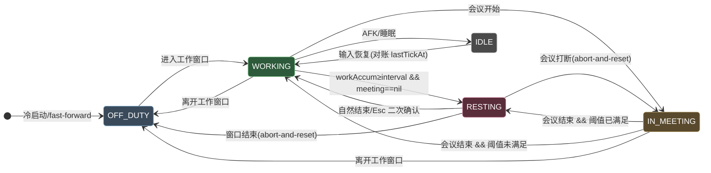

# Give me a break 设计文档

> macOS 强制作息应用的工程设计与循证依据。协作规约见 [AGENTS.md](../AGENTS.md)，快速上手见 [README](../README.md)。

## 1. 设计目标

在用户自定义工作时段内执行「工作 / 强制休息」节律；休息时遮罩全部显示器并控制 QQ 音乐；Google 日历会议计为工作但推迟休息。核心是**单调 wall-clock 工作累加器 + 反应式 FSM**，对抗「会议/睡眠/AFK」等非确定性输入对静态日程的扰动。

## 2. 调度引擎

### 2.1 状态机（5 态）



色彩语义：蓝灰=下班、绿=工作、琥珀=会议、品红=休息、中性灰=空闲；前景 `#fff` + 深色填充，深/浅模式对比度均 > 7:1（WCAG AAA）。

### 2.2 谓词优先级（`evaluate` 纯函数）

```
evaluate(now) 按顺序短路求值，首个匹配决定目标态：
  (1) NOT inAnyWorkWindow(now)  → OFF_DUTY      [最高，压过会议]
  (2) isAFK(now) OR isAsleep    → IDLE
  (3) activeMeeting(now) != nil → IN_MEETING    [会议压过休息]
  (4) workAccum >= workInterval → RESTING
  (5) otherwise                 → WORKING
触发休息的不变量：workAccum >= workInterval AND activeMeeting == nil
```

`evaluate` 是**零时间依赖纯函数**<sup>[[1]](#ref1)</sup>：所有时间经注入的 `Clock` 进入快照，可用 `VirtualClock` 单元测试。

### 2.3 累加器推进规则（防跨睡眠回灌）

每 tick：`delta = now - lastTickAt`（限幅 ≤ 60s 防异常 tick）→ **第一步即更新 `lastTickAt = now`** → 仅当 `active && phase ∈ {working, inMeeting}` 才 `workAccum += delta`。睡眠/AFK 期间 `active=false`，delta 不计入；`handleWake()` 强制 `lastTickAt = now`，使首个唤醒 tick 的 delta≈0，**不回灌睡眠时长**<sup>[[2]](#ref2)</sup>。

### 2.4 工作示例验证（30 + 30 会议 → 60 工作 → 10 休息）

`workInterval=3000s`（50min）。t=0 WORKING 累加至 30min → t=30 会议开始 IN_MEETING，累加器续推 → t=50 穿越阈值但谓词 3 压过谓词 4，**不触发休息** → t=60 会议结束，`workAccum=3600≥3000` 且 meeting=nil → **RESTING**，reset，休息 60→70 → t=70 WORKING。✓ 已由单元测试 `U1` 断言。

## 3. 三大集成契约

| 契约 | 实现 | 关键 API | 权限 |
|---|---|---|---|
| **遮罩** | `LiveOverlayController` | 每 `NSScreen` 一个 borderless `NSPanel`，`level=CGShieldingWindowLevel()`<sup>[[3]](#ref3)</sup>（⚠️ 该 C 函数 Apple 已弃用，现代等价 `.screenSaver` / `CGWindowLevelForKey(.shieldingWindowLevelKey)`，同屏蔽层级；`LiveOverlayController.swift:73` 待平滑替换为 `.screenSaver`），`collectionBehavior=[.canJoinAllSpaces,.fullScreenAuxiliary,.canJoinAllApplications]`；Esc 经本地事件监听→`NSAlert` 二次确认 | 无（遮罩本身不需 TCC） |
| **音乐** | `LiveMusicController` | `NSWorkspace` 拉起 QQ 音乐 + CGEvent 合成 `NX_KEYTYPE_PLAY`(=16) 媒体键（`subtype=8` NX_SUBTYPE_AUX_CONTROL_BUTTONS）<sup>[[4]](#ref4)</sup>，OS 路由到 Now Playing 应用 | **Accessibility（必需）** |
| **日历** | `LiveCalendarProvider` | 单一 `EKEventStore`<sup>[[5]](#ref5)</sup>，`requestFullAccessToEvents()`，过滤 `sourceType==.calDAV`<sup>[[6]](#ref6)</sup> + busy，`EKEventStoreChanged` 推送 + 限流回退 | **完全日历访问** |

## 4. 数据模型

```swift
struct EngineState { phase; workAccumulatedSeconds; lastTickAt; restStartedAt; modelVersion }  // 单一事实源，Codable 持久化
struct DayPlanConfig { workWindows; workIntervalSeconds; restDurationSeconds; afkThresholdSeconds; schemaVersion }
struct MeetingTimeline { busyIntervals: [DateRange]; generatedAt }  // 合并后的不相交忙碌区间
func mergeBusyIntervals(_:) -> [DateRange]  // 纯函数，端点相接合并（背靠背会议视为连续）
```

崩溃恢复：启动加载持久化 `EngineState`，`fastForward(sanityLimit:)` 依间隔决策——短中断（≤300s）按工作态推进计入累加；长中断仅对账基点不回灌（`U11` 断言）。

## 5. 测试矩阵

`make test` → 自建运行器（CLT 无 XCTest/Swift Testing，见 [issue #1](../.agents/issue.md)）。

- **谓词优先级** P1-P5：offDuty 压过一切；idle 压过会议/阈值；会议压过阈值；阈值触发休息；默认 working。
- **工作示例** U1：30+30 会议→60 工作→10 休息（纯函数 + 引擎接线双重断言）。
- **边缘 case**：U2 会议恰在阈值点不触发瞬间休息；U3 背靠背会议跨接缝；U4 会议跨窗口边界→offDuty 优先；U7 休息被会议打断→abort-and-reset；U9 同态幂等（showOverlay 仅一次）。
- **健壮性**：U10 advance 限幅；U5 AFK 冻结累加器；U6 睡眠不回灌；U11 fast-forward 短推进/长冻结。
- **持久化**：config/state round-trip、缺失文件回退默认、损坏 JSON 不崩溃、schema 迁移。

## 6. 已验证 / 待实机核实

✅ 已无头验证：编译链接、47 单元测试、`.app` 装配签名、引擎启动与 phase 判定、DEBUG 周期遮罩 show/dismiss、持久化落盘、工作日志提示拦截 + `completeDeferredRest` rebase + 报告渲染幂等、优雅降级（权限未授时）。
⏳ 待真机核实（需用户授权 + 真实环境）：Accessibility 授予后 QQ 音乐播放/暂停；完全日历访问后 Google 会议推迟；macOS 26 `canBecomeKey` 稳定性；工作日志提示窗在多屏/全屏应用前的可见性与焦点。

## 7. 工作日志（休息前记录 + 周期报告）

### 7.1 设计依据（循证）

休息前弹窗记录「完成了什么 + 可选下一步」，本质是 **转换边界的认知闭合仪式**，而非生产力打卡：

- **Leroy 注意力残留 [7]**：任务切换时部分注意力滞留于前一任务（尤以未完成/被打断时为甚），降低后续认知资源。其在转换点写下「已完成 / 剩余 / 回归首步」的 *ready-to-resume plan*（< 1 分钟）即给大脑闭合 [8]。本特性的「下一步（可选）」字段即此干预的直接落地。
- **Stubblebine 插值日记 [9], [10]**：以「任务转换」为触发（非时钟），在转换点花 2–4 句、60–90 秒记录，保持轻盈否则首周即弃 [10]。本特性钉死在唯一转换边界（`.working → .resting`），文案为「闭合」而非「汇报」。
- **Fogg 行为模型 [11]**：动机低且可变时，最大化 Ability（简化）是改变行为的关键——故字段可选、回车即提交、到点自动放行（等待时长可配，默认 3 分钟；亦可设永久等待）、轮换占位、软字符计数（不硬截断、不设最小长度——最小长度是已证实的完成杀手 [12]）。
- **JITAI [13]**：提示在「已被接受的打断」（休息本身）时机出现，而非新增第二个打断；提供 *provide-nothing* 选项（连续跳过衰减 + 可关闭）以对抗习惯化与怨恨。

### 7.2 架构（正交，纯 FSM 零改动）

| 关注点 | 位置 | 说明 |
|---|---|---|
| 模型 | `Engine/Models.swift` `WorkLogEntry` / `PreBreakContext` | 纯数据，`Codable` 容错解码 |
| 存储 | `Engine/WorkLogStore.swift` | 镜像 `ConfigStore`：原子写 + 容错读，独立 `work-log.json` |
| 报告（纯函数） | `Engine/WorkLogReport.swift` | `filterWorkLogEntries` / `renderWorkLogReport`，确定性幂等 |
| pre-break 拦截 | `Engine/LiveGiveMeABreakEngine.tick()` | 副作用分发处最小拦截；`completeDeferredRest(now:)` |
| 提示窗 / 报告窗 | `Integrations/WorkLog/` | SwiftUI + NSHostingController（同 `SettingsWindowController` 范式） |

**纯 FSM（`evaluate`/`transition`/`sideEffects`）零改动**——它是跨平台单一事实源（与 Windows C# 端共享 fixture，见 [windows-port-design.md](./windows-port-design.md)）。工作日志仅是接线层的副作用拦截 + 独立存储 + 独立报告。

### 7.3 tick() 副作用拦截 + 心跳冻结

```
tick() 检测 eff.showOverlay（.working → .resting）
  ├─ willDefer = onPreBreak != nil && config.workLogEnabled && !forcedRest
  ├─ if willDefer: 调 onPreBreak(ctx)；本 tick 跳过 overlay.show / music（延迟）
  │     └─ AppRoot.handlePreBreak(ctx):
  │          ├─ 门控：workAccum < 15min 且非 DEBUG → 不弹，直接 completeDeferredRest
  │          ├─ 连续跳过衰减：≥3 次 → 本次静默并清零（自愈）
  │          ├─ 弹提示：heartbeat.suspend()（冻结 tick，休息倒计时不被侵蚀）+ present(timeout)
  │          └─ 提交/跳过/超时/关窗 → WorkLogStore.append（仅提交非空）→ completeDeferredRest → resume
  └─ else: overlay.show / music（既有路径不变）
```

**`completeDeferredRest(now:)` 是第二个「绕过 tick 直接改 state」的路径**（首个为 `requestEarlyRestExit`）。遵循 [issue #6](../.agents/issue.md) 铁律——与 tick 不变量逐一对齐：guard `phase == .resting`；`restStartedAt = now`（rebase，完整休息时长不被提示耗时侵蚀）；`lastTickAt = now`（rebase 对账基点，恢复心跳后首 tick delta≈0 不回灌）；不改 phase、不动 `forcedRest`（仅离开 `.resting` 时清）。

**永不阻塞休息**：回车提交 / Esc / 跳过按钮 / 红色关闭按钮（`windowWillClose`）/ 到点 `DispatchSource` 超时（等待时长由 `config.workLogPromptTimeoutSeconds` 配置，独立于被冻结的引擎心跳）任一即 `completeDeferredRest` 升起遮罩。**永久等待**（`workLogPromptTimeoutSeconds == 0`）下不调度超时定时器，仅靠前几路手动出口；系统唤醒时若提示窗仍开启则不抢恢复心跳，避免延迟休息被静默判定结束。

**规避 [issue #6](../.agents/issue.md) z-order 陷阱**：提示窗在遮罩**之前**渲染（普通 `.floating` 层级），而非塞进 `CGShieldingWindowLevel` 遮罩内部或用 `NSAlert`（后者会被遮罩遮挡不可见）。

**向后兼容**：`onPreBreak == nil`（既有所有单测）→ `willDefer = false` → 行为与历史逐字节一致；既有测试零回归。

### 7.4 数据模型与报告

`WorkLogEntry { id, startedAt(≈restStartedAt − workAccum), endedAt(=restStartedAt), summary, nextAction?, durationSeconds, modelVersion }`，持久化 `~/Library/Application Support/com.aurelius.givemeabreak/work-log.json`，schema 见 [shared/work-log.schema.json](../shared/work-log.schema.json)。

`renderWorkLogReport` 按 `startedAt` 在指定时区分桶，产出今日/本周/月报/全部 Markdown：恰好一个 H1 + blockquote 元数据（周期/时区/条数/总专注时长）+ Top 3（按时长降序）+ 按日或按周拆解 + 待续·下一步（聚合 `nextAction`）。日期格式化全用 `Calendar` 组件手动拼接（零 locale 依赖，**确定性幂等**：同 entries + 同 now/cal/tz → 字节一致，便于 git diff）。v1 不做模糊去重/关键词 tag 推断（避免隐藏用户原始数据 + 误合并）。

## References

<a id="ref1"></a>[1] Apple Inc., "NSWindow.Level.screenSaver — Window Levels," *AppKit Developer Documentation*, 2026. [Online]. Available: https://developer.apple.com/documentation/appkit/nswindow/level-swift.struct/screensaver
<a id="ref2"></a>[2] Apple Inc., "NSWorkspace willSleepNotification / didWakeNotification," *AppKit Reference*, 2024.
<a id="ref3"></a>[3] Apple Inc., "CGShieldingWindowLevel()（已弃用；等价 `CGWindowLevelForKey(kCGShieldingWindowLevelKey)` = `NSWindow.Level.screenSaver`，同屏蔽层级）/ NSWindow collectionBehavior," *Core Graphics & AppKit Developer Documentation*, 2026. [Online]. Available: https://developer.apple.com/documentation/coregraphics/cgshieldingwindowlevel()
<a id="ref4"></a>[4] Apple Inc., "NX_KEYTYPE_PLAY and AUX_CONTROL_BUTTONS," *IOKit HID Event Types (ev_keymap.h)*, 2024.
<a id="ref5"></a>[5] Apple Inc., "EKEventStore / requestFullAccessToEvents / EKEventStoreChanged," *EventKit Framework Reference*, 2024.
<a id="ref6"></a>[6] Apple Inc., "EKSource sourceType (.calDAV)," *EventKit Reference*, 2024.
<a id="ref7"></a>[7] S. Leroy, "Why is it so hard to do my work? The challenge of attention residue when switching between work tasks," *Organizational Behavior and Human Decision Processes*, vol. 109, no. 2, pp. 168–181, 2009. [Online]. Available: https://www.sciencedirect.com/science/article/abs/pii/S0749597809000399
<a id="ref8"></a>[8] M. Tishma, "Conquering Attention Residue," *Chief Learning Officer*, Mar. 2018. [Online]. Available: https://www.chieflearningofficer.com/2018/03/02/conquering-attention-residue/
<a id="ref9"></a>[9] T. Stubblebine, "Replace Your To-Do List With Interstitial Journaling To Increase Productivity," *Better Humans / Medium*, Sep. 2017. [Online]. Available: https://betterhumans.pub/replace-your-to-do-list-with-interstitial-journaling-to-increase-productivity-4e43109d15ef
<a id="ref10"></a>[10] D. Chen, "Interstitial Journaling: Method, Prompts & Science," *Life Note*, 2026. [Online]. Available: https://blog.mylifenote.ai/interstitial-journaling/
<a id="ref11"></a>[11] B. Fogg, "Fogg Behavior Model — Prompts (Facilitator / Signal / Spark)," *Stanford Behavior Design Lab*. [Online]. Available: https://www.behaviormodel.org/prompts
<a id="ref12"></a>[12] "Required Fields in Forms: Best Design Practices," *UX Tigers*, 2024. [Online]. Available: https://www.uxtigers.com/post/required-fields
<a id="ref13"></a>[13] I. Nahum-Shani et al., "Just-in-Time Adaptive Interventions (JITAIs) in Mobile Health: Key Components and Design Principles for Ongoing Health Behavior Support," *Annals of Behavioral Medicine*, 2016. [Online]. Available: https://pmc.ncbi.nlm.nih.gov/articles/PMC5364076/
