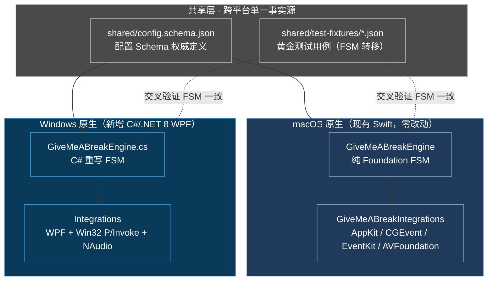
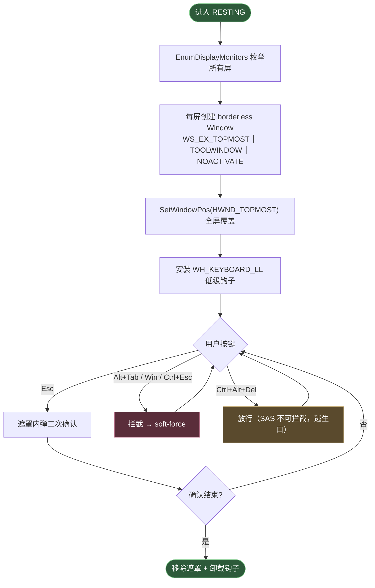
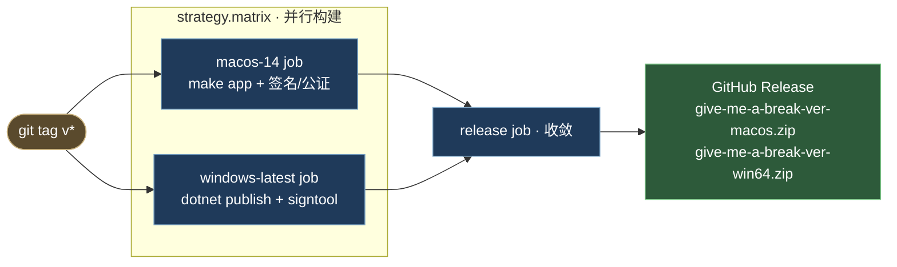

# Give me a break Windows 移植技术方案

> macOS 强制作息应用移植至 Windows 10/11 的工程设计与循证评估。本方案回答两个前置问题——「能否在编译 macOS 版的同时顺便产出 Windows 版」「若不能，最务实的路径是什么」，供维护者评估是否启动实现。
> 关联：协作规约见 [AGENTS.md](../AGENTS.md)，应用主文档见 [README](../README.md)，macOS 原始设计见 [设计文档](./give-me-a-break-design.md)，发布链路见 [`.github/workflows/release.yml`](../.github/workflows/release.yml)。

## 1. 背景与核心结论

Give me a break 当前为纯 Swift（SPM，macOS 14+）实现，采用三目标正交分解（见 [设计文档 §架构](./give-me-a-break-design.md#2-调度引擎)）：

- **`GiveMeABreakEngine`**：纯 Foundation（FSM + `evaluate` 纯函数 + JSON 持久化），零平台依赖；
- **`GiveMeABreakIntegrations`**：深度 macOS 集成（AppKit / CGEvent / EventKit / AVAudioEngine / ServiceManagement）；
- **`GiveMeABreak`**：`@main` 壳。

维护者希望：在 GitHub Release 页同时提供 macOS 与 Windows 两套安装包，让不同 OS 用户自行选择。本方案的循证结论如下：

> **结论 1（Q2 可行性）**：**无法「顺便」编译 Windows 版**。Swift 语言本身可在 Windows 上官方编译<sup>[[1]](#ref1)</sup>，但 `GiveMeABreakIntegrations` 依赖的 AppKit / CoreGraphics / EventKit / AVFoundation 等 Apple 专有框架在 Windows 上**物理不存在**（逐项已验证），`import AppKit` 在 Windows 工具链直接编译失败。
>
> **结论 2（Q2 务实路径）**：唯一可行的跨平台资产是纯 Foundation 的 `GiveMeABreakEngine`。完整 Windows 桌面应用须**重写（非移植）整个集成层**，推荐 **C#/.NET 8 WPF 原生重写 + 共享纯逻辑核心**，工作量集中在一个核心难点——全屏强制遮罩。
>
> **结论 3（Q1 macOS 发布）**：与 Windows 移植解耦。macOS 发布链路已就绪（`release.yml`，打 tag 即发布），详见 [README §构建与运行](../README.md#构建与运行)与本仓库 commit `fix(release)` 的 `--timestamp` 修复。

## 2. 跨平台不可行性循证

### 2.1 Swift 语言 vs Apple 框架（关键区分）

「Swift 可跨平台」这一直觉，**仅对语言与 Foundation 标准库成立，对 Apple UI/系统框架不成立**：

| 层面 | Windows 可用性 | 证据 |
|---|---|---|
| Swift 编译器 / SPM | ✅ 官方一级支持（Swift 6.x，x86_64 + arm64）<sup>[[1]](#ref1)</sup> | swift.org 提供官方 Windows 工具链，由 Swift.org Windows Workgroup 维护 |
| Foundation（`Date`/`Codable`/`Dispatch`） | ✅ 可用（swift-corelibs-foundation） | 纯逻辑包可 `swift build` 通过 |
| **AppKit**（`NSStatusItem`/`NSPanel`/`NSWorkspace`） | ❌ **完全不可用**<sup>[[2]](#ref2)</sup> | Apple 闭源，`swift-corelibs-appkit` 长期休眠，从未移植 |
| **CoreGraphics**（`CGEvent`/`CGShieldingWindowLevel`） | ❌ **完全不可用**<sup>[[3]](#ref3)</sup> | macOS 专有，Windows 无对应物 |
| **EventKit**（`EKEventStore`） | ❌ **完全不可用**<sup>[[4]](#ref4)</sup> | 绑定 macOS 日历数据库 |
| **AVFoundation**（`AVAudioEngine`） | ❌ 不可用 | macOS/iOS 专有 |
| SwiftUI | ⚠️ 仅第三方实验性（Tokamak/SwiftCrossUI），未达生产可用 | Apple 闭源，官方仅支持 Apple 五平台 |

### 2.2 本项目的绑定盘点（硬数据）

经全量代码勘察（`Sources/GiveMeABreakIntegrations/` 13 文件 + `Sources/GiveMeABreak/` + `scripts/generate_icon.swift`）：

- **`GiveMeABreakEngine`（5 文件）**：100% 纯 Foundation，**可直接在 Windows 编译**，是唯一跨平台资产；
- **`GiveMeABreakIntegrations`（13 文件）**：**12 个（≈92%，约 960 行）macOS 专有**，仅 `Heartbeat.swift`（36 行，`DispatchSourceTimer`）可跨平台；
- 绑定框架分布：AppKit（8 文件）、CoreGraphics/CGEvent（4 文件）、EventKit（1）、AVFoundation（1）、ServiceManagement（1）、ApplicationServices（1）。

> 「顺便编译」在工程上不可能：这不是「配置一下」的问题，而是**框架在目标 OS 上物理不存在**，重写是唯一路径。

## 3. 推荐架构：共享纯逻辑核心 + C#/.NET 8 WPF

### 3.1 为何不复用 Swift 核心（FFI）

`GiveMeABreakEngine` 可经 Windows 版 `swift build` 编译为 DLL，再由 C# 经 P/Invoke 调用。但**不推荐**：

- Swift↔CLR 边界工具链（如 SwiftToCLR）仅实验性 PoC， ABI 不稳定；
- `GiveMeABreakEngine` 仅数百行纯逻辑，**C# 等价重写的成本 < 长期维护 FFI 边界**；
- 两端各自原生（Swift / C#）更易测试、调试、演进。

故采用 **C# 端重写 `GiveMeABreakEngine`**，通过**共享黄金测试用例**保证两端 FSM 行为一致。

### 3.2 架构总览



**项目结构**（新增 `windows/` 与 Swift 工程并列，互不侵入）：

```
├── Sources/                # 现有 Swift（macOS，零改动）
├── windows/                # 新增 C#/.NET 8 WPF 工程
│   ├── GiveMeABreakEngine/      # C# 重写 FSM（对齐 evaluate 谓词优先级）
│   ├── GiveMeABreakIntegrations/# Win32 P/Invoke + WPF 集成
│   └── GiveMeABreak/            # WPF 入口 + NotifyIcon
├── shared/                 # 跨平台单一事实源
│   ├── config.schema.json  # 配置 schema（Swift Codable / C# System.Text.Json 双向兼容）
│   └── test-fixtures/      # 黄金测试 JSON（两端共用）
```

## 4. 逐能力 macOS → Windows 实现映射

| 能力 | macOS 实现 | Windows 实现 | 工作量 |
|---|---|---|---|
| 粉噪音合成 | `AVAudioEngine` 实时滤波 | [NAudio] `SignalGenerator(PinkNoise)` | 低 |
| 合成媒体键 | `CGEvent`（`NX_KEYTYPE_PLAY`） | `SendInput` + `VK_MEDIA_PLAY_PAUSE`<sup>[[5]](#ref5)</sup> | 低 |
| 空闲检测 | `CGEventSource.secondsSinceLastEventType` | `GetLastInputInfo` + `GetTickCount64`<sup>[[6]](#ref6)</sup>（须 64 位 tick，避 49.7 天回绕） | 低 |
| 菜单栏图标 | `NSStatusItem` + `NSMenu` | WinForms `NotifyIcon` + ContextMenuStrip<sup>[[8]](#ref8)</sup> | 低 |
| sleep/wake | `NSWorkspace` 通知 | `SystemEvents.PowerModeChanged` | 低 |
| 开机自启 | `SMAppService` | 注册表 `HKCU\...\Run`（非提权）/ Task Scheduler | 低 |
| 配置持久化 | `Codable` JSON | `System.Text.Json`（对齐 schema） | 低 |
| 日历门控 | `EventKit`（CalDAV 复用 OS 登录态） | **Microsoft Graph API**（Azure AD + MSAL）<sup>[[9]](#ref9)</sup>；Google 日历另走 Google Calendar API | 中 |
| **全屏强制遮罩** | `CGShieldingWindowLevel`<sup>[[3]](#ref3)</sup> | **见 §5（核心难点）** | **高** |
| 辅助功能检查 | `AXIsProcessTrusted` | （Windows `SendInput` 不需辅助功能权限，可省） | — |

> 注：macOS 的 CGEvent 媒体键需 **Accessibility 权限**；Windows 的 `SendInput` **无需**等价授权，反而更省心——但 `WH_KEYBOARD_LL` 全局钩子会触发杀软警觉（见 §7）。

## 5. 全屏强制遮罩的 Windows 妥协设计（核心难点）

这是整个移植的**阿喀琉斯之踵**。macOS 的 `CGShieldingWindowLevel()` 能压过 Dock、菜单栏、全屏应用、屏保<sup>[[3]](#ref3)</sup>；Windows **没有任何单一 API 等价物**，`HWND_TOPMOST` 在多场景盖不住 taskbar<sup>[[12]](#ref12)</sup>。故采用**妥协分层**，诚实接受「软强制」本质（对齐 macOS 版 Esc 二次确认的设计哲学，见 [issue #2](../.agents/issue.md)）：



**设计决策与诚实披露**：

1. **窗口层级**：`WS_EX_TOPMOST | WS_EX_TOOLWINDOW | WS_EX_NOACTIVATE` + `SetWindowPos(HWND_TOPMOST)`，`EnumDisplayMonitors` 为每屏各起一个全屏窗口（对齐 macOS 每 `NSScreen` 一个 `NSPanel`）。
2. **taskbar 偶现视为可接受**：与 macOS `CGShieldingWindowLevel` 的根本差距，诚实披露——这是 Windows 平台的固有约束，非实现缺陷。
3. **`WH_KEYBOARD_LL` 拦截 Alt+Tab / Win / Ctrl+Esc** 实现 soft-force<sup>[[7]](#ref7)</sup>；**明确不拦 Ctrl+Alt+Del**——Secure Attention Sequence（SAS）在内核层不可拦截，保留逃生口，符合软强制哲学（留摩擦而非硬锁，同 macOS 版「force-quit 始终可终止」的已知限制，见 [README §已知限制](../README.md#已知限制透明披露)）。
4. **Esc 二次确认** UI 在遮罩窗口内渲染（复用 macOS 版 `isConfirming` 语义），避免依赖系统对话框被遮罩自身遮挡的坑（同构于 [issue #2](../.agents/issue.md) 的 Esc 退出失效修复）。

## 6. 配置与行为一致性（防漂移）

两端必须保证 FSM 行为不漂移，采用**双单一事实源**：

- **配置 Schema**：`shared/config.schema.json` 为权威定义；Swift 端 `Codable`、C# 端 `System.Text.Json` 双向兼容（含 `schemaVersion` 迁移，对齐 macOS 现有 [配置迁移](./give-me-a-break-design.md#4-数据模型)）。
- **黄金测试用例**：`shared/test-fixtures/*.json` 封装 FSM 输入快照与期望态（含 [设计文档 §2.4](./give-me-a-break-design.md#24-工作示例验证30--30-会议--60-工作--10-休息) 的 30+30→60→10 工作示例、会议打断 abort-and-reset、AFK 冻结、睡眠不回灌等）。两端引擎共用同一份 fixture，**任一端失败即阻断 CI**，从机制上消除行为漂移。

## 7. CI 与多平台 Release

采用**单 workflow + `strategy.matrix`**，规避多 workflow 同 tag 竞态（`softprops/action-gh-release` 已知多 workflow 并发挂 asset 的竞态问题）：



**关键点**：

- **矩阵构建**：`os: [macos-14, windows-latest]` 并行；下游 `release` job `needs: [macos, windows]` 收敛后**一次性** `softprops/action-gh-release` 挂载全部 asset。
- **asset 命名**：`give-me-a-break-<ver>-macos.zip` / `give-me-a-break-<ver>-win64.zip`（macOS 端命名已在本仓库 `fix(release)` commit 规范化预留）。
- **环境差异**：macOS 复用现有 `setup-macos-swift` + `make app`；Windows 用 `setup-dotnet` + `dotnet publish -c Release -r win-x64 --self-contained`。
- **`GiveMeABreakEngine` 跨平台冒烟（零成本技术储备）**：可额外加 `windows-latest` job 跑 `setup-swift` + `swift test`，验证纯 Foundation 核心在 Windows 编译通过——不依赖任何 Windows UI 实现。

## 8. 代码签名与分发

| 平台 | 机制 | 成本 | 现状 |
|---|---|---|---|
| macOS | Developer ID 签名 + Apple 公证（`notarytool`） | Apple Developer Program **$99/年**；签名/公证含在内 | `release.yml` 已预留演进开关（`ENABLE_DEVELOPER_ID_SIGNING`），补 `--timestamp` 后即可激活<sup>[[10]](#ref10)</sup> |
| Windows | Authenticode 代码签名（`signtool`） | OV 证书约 $200–400/年；EV 更贵 | 需新增 `WINDOWS_CERT_PFX` 等 secrets |

> **Windows 签名注意（已验证的误区）**：自 **2023-06** 起 Microsoft 强制所有代码签名证书（含 OV）使用硬件安全模块（HSM/Token），CI 中需经 USB token 转发或云签名服务（如 Azure Trusted Signing）；且 **2024 起 EV 证书不再保证立即通过 SmartScreen**，新应用仍需逐步累积信誉<sup>[[13]](#ref13)</sup>。未签名或低信誉应用会触发 SmartScreen 警告，用户体验等同于 macOS ad-hoc 的 Gatekeeper 拦截。

## 9. 风险与误区（诚实披露）

| 风险/误区 | 说明与对策 |
|---|---|
| **杀软误报** | `WH_KEYBOARD_LL` 全局键盘钩子 + `SendInput` 媒体键易被 Defender / 360 / 火绒误判为恶意软件<sup>[[7]](#ref7)</sup>。**必备**：Authenticode 代码签名 + 面向用户的白名单指引文档。 |
| **全屏遮罩不完美** | taskbar 偶现、Ctrl+Alt+Del 逃生是 Windows 固有约束，非 bug。需在 README 明确告知 Windows 用户，管理预期。 |
| **日历集成差异** | macOS 复用 OS Google 账户（CalDAV，零 OAuth 代码）；Windows 上 Google 日历须走 Google Calendar API（OAuth），Microsoft 日历走 Graph API——两端权限模型不一致，需独立实现。 |
| **误区：Swift 像 Java 一次编写到处跑** | 错。Swift **语言**可跨平台，但 AppKit/SwiftUI/CoreGraphics 不跨平台。Java 跨平台靠完整 JDK 标准库，Swift 无等价跨平台 GUI 库。 |
| **误区：GitHub Windows runner 自带 Swift** | 错。`windows-latest` 默认未预装 Swift，需 `swift-actions/setup-swift` 显式安装；且即便安装，`import AppKit` 仍编译失败。 |
| **误区：ad-hoc 签名可双击即开** | 错。macOS ad-hoc 触发 `com.apple.quarantine`，Gatekeeper 拦截；macOS 15.1 Sequoia 起「右键→打开」已失效<sup>[[11]](#ref11)</sup>，须 `xattr` 放行。Windows 未签名则触发 SmartScreen。两端「下载即装」均需付费签名。 |

## 10. 分阶段实施计划（供评估）

| 阶段 | 内容 | 产出 | 决策门 |
|---|---|---|---|
| **Phase 0** | C# 重写 `GiveMeABreakEngine` + `shared/` 黄金测试，交叉验证 FSM 一致 | 纯核心两端行为对齐 | ✅ 可独立验证，风险最低，**建议作为启动首步** |
| **Phase 1** | NAudio 粉噪音 + `SendInput` 媒体键 + `NotifyIcon` 托盘 | 最小可运行 Windows 壳（无遮罩） | 验证 WPF + Win32 P/Invoke 可行性 |
| **Phase 2** | 全屏遮罩 + `WH_KEYBOARD_LL`（§5 核心难点） | 强制休息在 Windows 可用 | 攻坚 taskbar/SAS 妥协，**最大不确定性所在** |
| **Phase 3** | 日历门控（Graph API + Google Calendar API） | 会议推迟休息对齐 | 两套 OAuth，工作量中等 |
| **Phase 4** | CI 多平台 Release（§7）+ Windows 代码签名 | GitHub Release 双 asset | 含签名证书采购决策 |

### 10.1 实现进展：Phase 0 已落地（2026-06）

Phase 0 已实现并通过双端验证，作为 Windows 移植的首块基石：

- **[`windows/GiveMeABreakEngine/`](../windows/GiveMeABreakEngine/)**（.NET 8 类库）：C# 1:1 重写纯核心 8 文件（`Models/` + `Engine.cs` + `LiveGiveMeABreakEngine.cs` + `ConfigStore.cs` + `Protocols.cs` + `_JsonConverters.cs`），镜像 `Sources/GiveMeABreakEngine/` 的 FSM 语义，零第三方依赖；
- **[`shared/`](../shared/)**（跨平台单一事实源）：[`config.schema.json`](../shared/config.schema.json) + [`test-fixtures/`](../shared/test-fixtures/) 四份黄金 fixture（evaluate/advance/side-effects/merge-busy），统一用 Unix epoch 整数秒编码，规避两端时间格式差异；
- **[`windows/GiveMeABreakEngine.CSharpTests/`](../windows/GiveMeABreakEngine.CSharpTests/)**（xUnit）：A 层 fixture 驱动 + B 层镜像，**25 测试全绿**（60ms），覆盖 P1-P5 谓词优先级、advance 限幅、休息生命周期四分支、会议 abort-and-reset、forcedRest Bug2 回归、ConfigStore schema 迁移；Swift 端回归 **34 全绿**，确认 `Sources/` 零改动无回归；
- **[`.github/workflows/ci.yml`](../.github/workflows/ci.yml)**：新增 `dotnet-test`（阻断型）+ `swift-core-smoke`（探针、`continue-on-error` 非阻断）两个 windows-latest job。

> **黄金测试策略（务实混合，非全 JSON 化）**：纯函数走 JSON fixture（机器保证 FSM 决策不漂移，任一端失败即阻断 CI）；多 tick 时序场景走镜像测试（以 Swift 用例名为锚点人工对照，`Simulator`/`Mock` 辅助类忠实重写）。Swift `Sources/` **永不改动**——C# 是平行重写。

### 10.2 实现进展：Phase 1 已落地（2026-06）

Phase 1（最小可运行 Windows 壳，无遮罩）已实现，验证策略为 **纯 CI（windows-latest）**——开发机 macOS 无法本地运行 Windows-only 代码。核心设计是**分层把不可本地验证的代码压到最小**：

- **[`windows/GiveMeABreakEngine.Win32/`](../windows/GiveMeABreakEngine.Win32/)（net8.0）**：`[DllImport]` 声明（`GetLastInputInfo`/`GetTickCount64`/`SendInput`，元数据 net8.0 可编译）+ [`PinkNoiseGenerator`](../windows/GiveMeABreakEngine.Win32/PinkNoiseGenerator.cs)（Paul Kellet 逐字移植 `AmbientSoundPlayer`）+ mockable 集成逻辑（`MediaKeySender`/`Win32IdleProbe`/`QqMusicDetector`，抽 `ISendInputPort`/`IProcessNameProvider` 隔离 native 调用）；
- **[`windows/GiveMeABreakEngine.Win32Tests/`](../windows/GiveMeABreakEngine.Win32Tests/)（net8.0 xUnit，12 测试 macOS 本地全绿）**：粉噪音保真（Goertzel 单频功率/RMS/淡入/循环无点击）+ 空闲 49.7 天 64 位回绕 + 媒体键 down+up 序列；
- **[`windows/GiveMeABreakShell/`](../windows/GiveMeABreakShell/)（net8.0-windows WPF 壳，CI-only）**：6 个 interface 的 Phase 1 实现（`NoopOverlayController` 占位 / `WasapiAmbientPlayer`(NAudio) / `MusicController`(粉噪音+QQ音乐媒体键) / `WindowsSystemState` / `EmptyCalendarProvider` / `HeartbeatTimer`）+ [`TrayController`](../windows/GiveMeABreakShell/Tray/TrayController.cs)(H.NotifyIcon) + [`PowerEventBridge`](../windows/GiveMeABreakShell/Power/PowerEventBridge.cs) + [`RegistryAutostart`](../windows/GiveMeABreakShell/Autostart/RegistryAutostart.cs)；
- **[`.github/workflows/ci.yml`](../.github/workflows/ci.yml)** 三层验证：**L1** 双平台 `dotnet-test`(windows) + `dotnet-test-mac`(macos-14) 跑 net8.0 测试（37 测试，证明真跨平台）；**L2** `dotnet-build-shell` 编译+publish WPF 壳；**L3** `dotnet-smoke-shell` headless 烟测（`GIVEMEABREAK_HEADLESS` 跳过托盘/WASAPI，`GIVEMEABREAK_DEBUG` 极速配置触发相位转移）。

> **诚实披露（CI 能证 / 不能证）**：L1-L3 能证「壳启动不崩 + 引擎装配闭环 + 配置落盘 %APPDATA% + P/Invoke 声明 JIT 执行无 EntryPointNotFound」。**不能证**：托盘图标可见（CI 无 explorer shell）、WASAPI 出声（无设备）、媒体键触发 QQ 音乐（无 QQ 音乐/Now Playing）、全屏遮罩（Phase 2）——这些归用户 Windows 真机验收。QQ 音乐候选进程名（`QQMusic`/`QQMusicTray`）需用户实测校准。
>
> **依赖**：粉噪音自写 Kellet（对齐 macOS + 零依赖 + 可测）；NAudio 2.2.1（壳内 WASAPI 播放）；H.NotifyIcon.Wpf 2.2.0（壳内托盘）。均不污染 net8.0 工程。toggle 语义继承（`VK_MEDIA_PLAY_PAUSE` 与 macOS `NX_KEYTYPE_PLAY` 同构，正在播时发键反暂停是已知限制）。下一阶段见 §10 Phase 2（全屏强制遮罩，§5 核心难点）。
>
> **评估建议**：Phase 0–1 风险可控、可独立交付价值，建议先行以验证整体可行性；Phase 2（全屏遮罩）是「继续投入 vs 放弃 Windows」的真正决策点——其妥协（taskbar 偶现、SAS 逃生）是否可接受，决定了 Windows 版能否达到与 macOS 版同等的「软强制」体验。

### 10.3 实现进展：Phase 2 已落地（2026-06）

Phase 2（全屏强制遮罩，§5 核心难点）已实现，替换 Phase 1 的 `NoopOverlayController` 占位：

- **[`windows/GiveMeABreakEngine.Win32/NativeOverlay.cs`](../windows/GiveMeABreakEngine.Win32/NativeOverlay.cs)（net8.0）**：`WH_KEYBOARD_LL`/`SetWindowPos`/`SetWindowLong`/`EnumDisplayMonitors` 的 P/Invoke + `KBDLLHOOKSTRUCT`/`RECT` 结构 + 常量（值锁单测，本地可验证）。
- **[`windows/GiveMeABreakShell/Overlay/`](../windows/GiveMeABreakShell/Overlay/)（net8.0-windows 壳）**：`OverlayWindow.xaml(.cs)`（WPF 全屏 borderless + `OnSourceInitialized` 强制 `WS_EX_TOPMOST` 规避 ShowInTaskbar 坑 + 渐变/倒计时/确认双态 + Esc 双语义 Stopwatch）+ `OverlayViewModel`（INPC，镜像 Swift）+ `KeyboardLowLevelHook`（拦截 Alt+Tab/Win，放行 Esc/Ctrl+Alt+Del）。
- **`FullscreenOverlayController`**：多屏（`EnumDisplayMonitors`，兜底虚拟屏）+ 屏幕热插拔（`DisplaySettingsChanged`）+ headless try/catch 降级记 `OVERLAY_*` 标记；`AppRoot` 桥接 `OnRequestEarlyExit` → `engine.RequestEarlyRestExit`（引擎内部 Dismiss，不自 Dismiss，对齐 macOS `confirmEarlyExit`）。

> **妥协诚实披露（§5）**：taskbar 偶现（Windows 固有，`WS_EX_TOPMOST` 无 `CGShieldingWindowLevel` 等价物）；Ctrl+Alt+Del 逃生（SAS 内核层不可拦）；Ctrl+Esc 不专门拦（`LLKHF` 无 Ctrl 标志，无法与纯 Esc 区分，Esc 全放行交 WPF 双语义）；`WH_KEYBOARD_LL` 可能触发杀软误报（Phase 4 签名根治）。CI 能证「遮罩 Show 被调 + 不崩」（`OVERLAY_SHOW_(OK|FAIL)` 断言），**真实覆盖/拦截/Esc 双语义归真机验收**（§10.2 评估建议所述决策门）。

### 10.4 实现进展：Phase 3 已落地（2026-06）

Phase 3（日历门控，Microsoft Graph）已实现，替换 `EmptyCalendarProvider` 条件注入：

- **[`windows/GiveMeABreakEngine.Graph/`](../windows/GiveMeABreakEngine.Graph/)（net8.0，零 NuGet）**：`GraphTimelineMapper`（纯解析：filter busy/tentative，排除 isAllDay，复用 `Engine.MergeBusyIntervals`）+ `TimelineCache`（限流 180s/60s + 线程安全）+ `GraphCalendarProvider`（`ICalendarProvider` 编排，mock `IGraphClient` 可测，fire-and-forget 刷新 + 失败降级）。
- **[`windows/GiveMeABreakShell/Adapters/MsalGraphClient.cs`](../windows/GiveMeABreakShell/Adapters/MsalGraphClient.cs)（壳）**：MSAL 设备码 flow（`PublicClientApplication` + `AcquireTokenWithDeviceCode`，callback 仅打印 URL+code）+ HttpClient GET `/me/calendarView` + `Prefer: outlook.timezone="UTC"` 强制 UTC。
- **配置**：`config.schema.json` + `DayPlanConfig.GraphClientId`（用户填 Azure 注册 id）；`AppRoot.BuildCalendarProvider` 条件注入——非空 → `GraphCalendarProvider(MsalGraphClient)`，空/失败 → `EmptyCalendarProvider`（headless 降级，`CALENDAR_DEGRADED` 标记）。Swift `Sources/` 零改动（Codable 忽略未知 key）。

> **OAuth 红线与诚实披露**：client id 从配置读，首次设备码授权 100% 用户完成（CLAUDE.md 浏览器验证协议红线，Agent 绝不认证）；CI 无法验证真实 Graph（无账户），仅证解析层（fixture）+ 编排（mock）+ 条件注入降级。token 内存缓存（重启重新设备码，Phase 4 可持久化）；`EKEventStoreChanged` 推送无 Graph 等价，靠 180s 惰性刷新。真机验收：Azure 注册公共客户端应用（允许设备码）→ 填 client id → 设备码授权 `Calendars.Read` → busy/tentative 会议推迟休息。

### 10.5 实现进展：Phase 4 已落地（2026-06）

Phase 4（CI 多平台 Release）已实现，[`release.yml`](../.github/workflows/release.yml) 改造为 3-job matrix（§7）：

- **macos job**（macos-14）：现有 ①-⑥ 链路**逐字保留**（版本校验/make app/条件 Developer ID 签名/公证/ditto 打包/验证），末尾改 `upload-artifact`(macos-zip) + version/notarized markers。
- **windows job**（windows-latest，新增）：`setup-dotnet` + `dotnet publish --self-contained -p:Version` + `Compress-Archive` → win64.zip artifact。**无签名步骤**（用户决策）。
- **release job**（ubuntu-latest，`needs [macos, windows]`）：download-artifact ×3（markers + 双 zip）+ flatten 子目录 + `softprops/action-gh-release` 一次挂双 asset + 双平台 body（macOS 公证/ad-hoc 动态告知 + Windows SmartScreen 无签名告知）。
- **版本跨 job**：version marker 文件（macos 写 `version.txt`，release 读）；tag 权威源，macos ① 校验 tag==Info.plist，windows 从 tag 取，三者一致。

> **Windows 无签名诚实披露**：未签名 `win64.zip` 触发 SmartScreen 警告（首次「更多信息→仍要运行」）+ 杀软可能误报（`WH_KEYBOARD_LL`/`SendInput`）。self-contained 含 .NET 运行时（~150MB，免用户装 .NET）。签名留后续单独 workflow（用户配 Azure Trusted Signing/证书）。**CI 无法本地验证**（CD，tag 触发），首个 tag（如 `v0.1.1`，先同步 `Info.plist`）回归验证 macOS 链路不破坏 + 双 asset 收敛。

## References

<a id="ref1"></a>[1] Swift.org, "Swift on Windows — Official Toolchain," *Swift.org*, 2026. [Online]. Available: https://www.swift.org/install/windows

<a id="ref2"></a>[2] Apple Inc., "AppKit — Framework Reference," *Apple Developer Documentation*, 2024. [Online]. Available: https://developer.apple.com/documentation/appkit

<a id="ref3"></a>[3] Apple Inc., "CGShieldingWindowLevel / CGEvent — Core Graphics Reference," *Apple Developer Documentation*, 2024. [Online]. Available: https://developer.apple.com/documentation/coregraphics

<a id="ref4"></a>[4] Apple Inc., "EventKit Framework — EKEventStore," *Apple Developer Documentation*, 2024. [Online]. Available: https://developer.apple.com/documentation/eventkit

<a id="ref5"></a>[5] Microsoft, "SendInput function and virtual-key codes (VK_MEDIA_PLAY_PAUSE)," *Microsoft Learn*, 2024. [Online]. Available: https://learn.microsoft.com/windows/win32/api/winuser/nf-winuser-sendinput

<a id="ref6"></a>[6] Microsoft, "GetLastInputInfo and GetTickCount64," *Microsoft Learn*, 2024. [Online]. Available: https://learn.microsoft.com/windows/win32/api/winuser/nf-winuser-getlastinputinfo

<a id="ref7"></a>[7] Microsoft, "LowLevelKeyboardProc callback function (WH_KEYBOARD_LL)," *Microsoft Learn*, 2024. [Online]. Available: https://learn.microsoft.com/windows/win32/winmsg/lowlevelkeyboardproc

<a id="ref8"></a>[8] Microsoft, "NotifyIcon (Windows Forms) — System Tray," *Microsoft Learn*, 2024. [Online]. Available: https://learn.microsoft.com/dotnet/api/system.windows.forms.notifyicon

<a id="ref9"></a>[9] Microsoft, "Microsoft Graph API — Calendar resources," *Microsoft Learn*, 2024. [Online]. Available: https://learn.microsoft.com/graph/api/resources/calendar

<a id="ref10"></a>[10] Apple Inc., "Resolving Common Notarization Issues," *Apple Developer Documentation*, 2024. [Online]. Available: https://developer.apple.com/documentation/security/resolving-common-notarization-issues

<a id="ref11"></a>[11] M. Tsai, "Sequoia Removes Gatekeeper Contextual Menu Override," *mjtsai.com*, 2024. [Online]. Available: https://mjtsai.com/blog/2024/07/05/sequoia-removes-gatekeeper-contextual-menu-override/

<a id="ref12"></a>[12] Stack Overflow, "Win32 full screen and hiding the taskbar," *stackoverflow.com*, 2024. [Online]. Available: https://stackoverflow.com/questions/2382464/win32-full-screen-and-hiding-taskbar

<a id="ref13"></a>[13] Microsoft, "SmartScreen reputation for Windows app developers," *Microsoft Learn*, 2025. [Online]. Available: https://learn.microsoft.com/en-us/windows/apps/package-and-deploy/smartscreen-reputation
